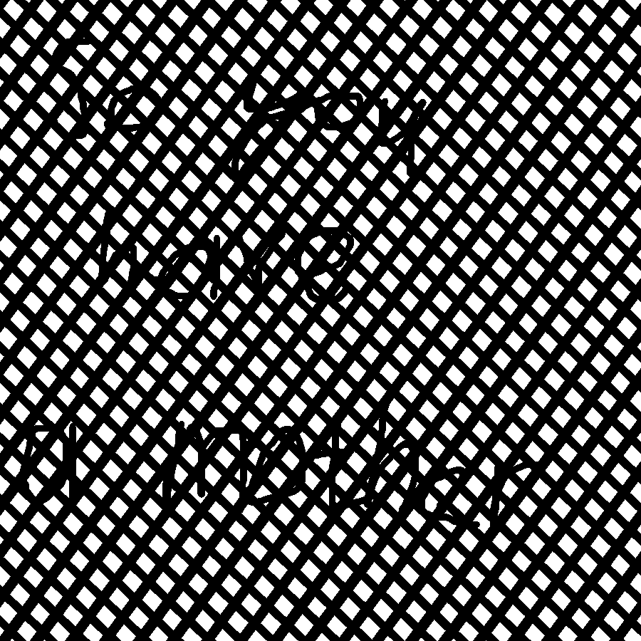
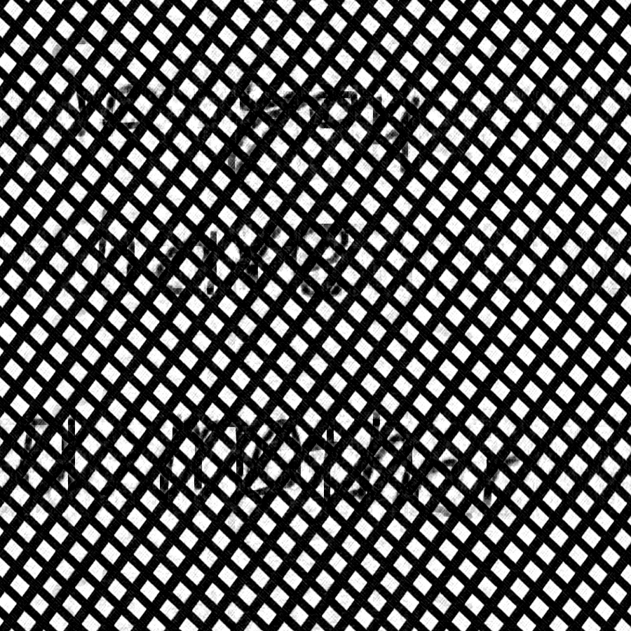
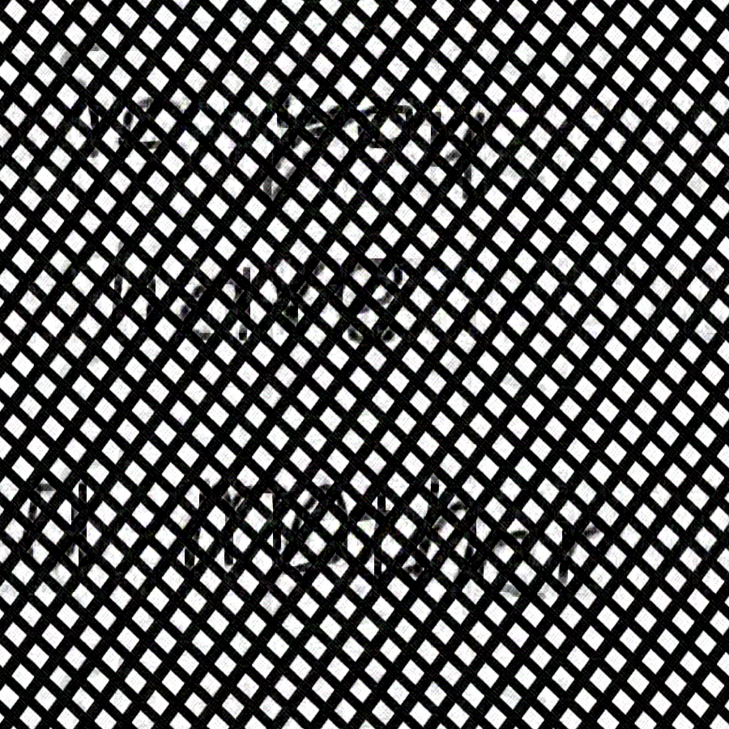
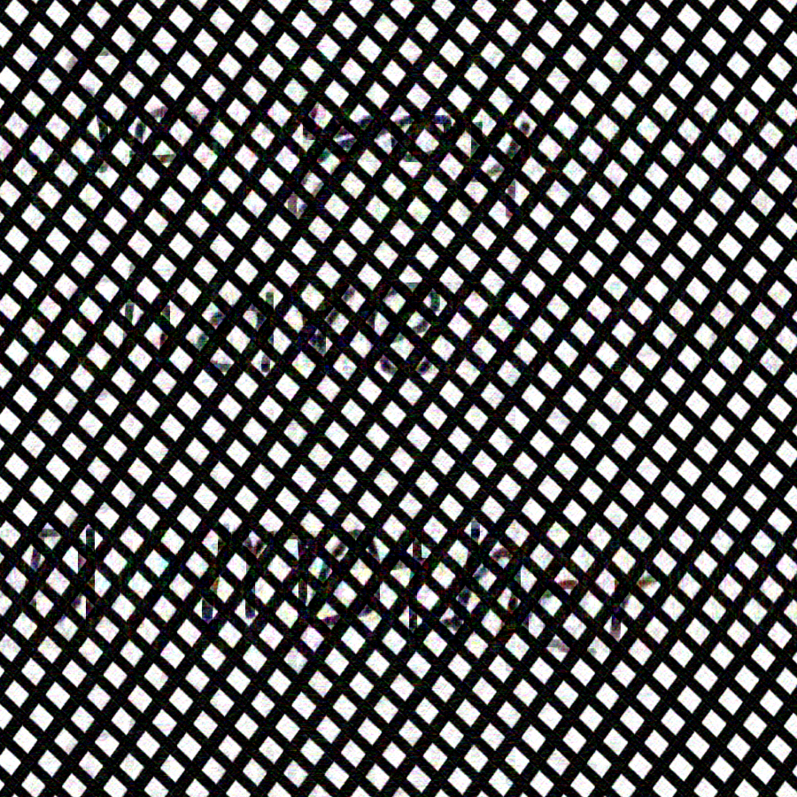
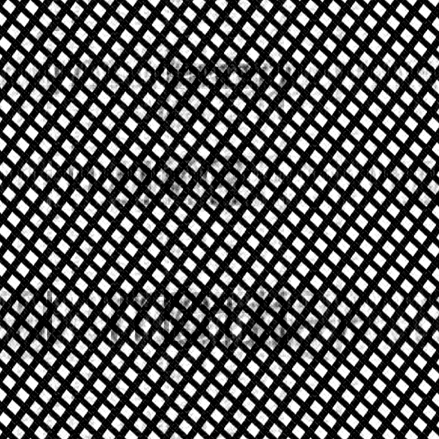
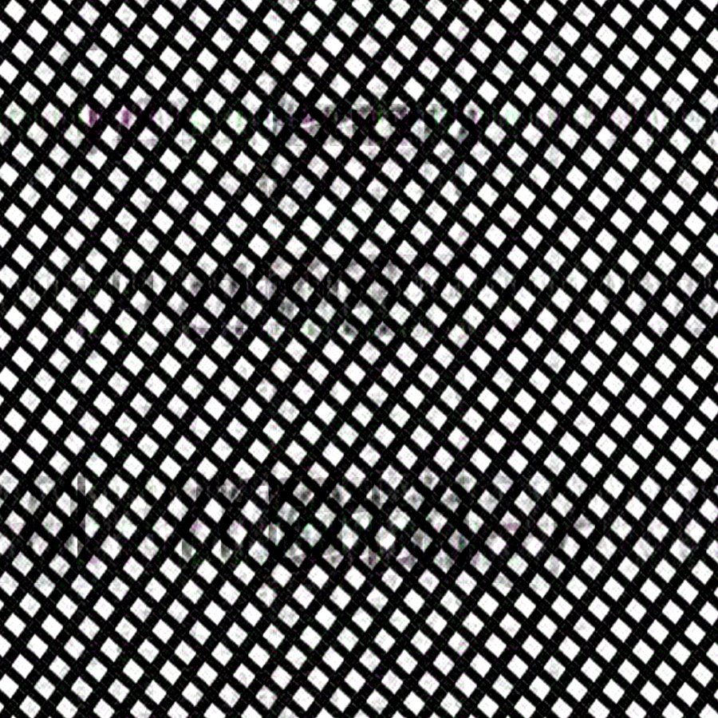
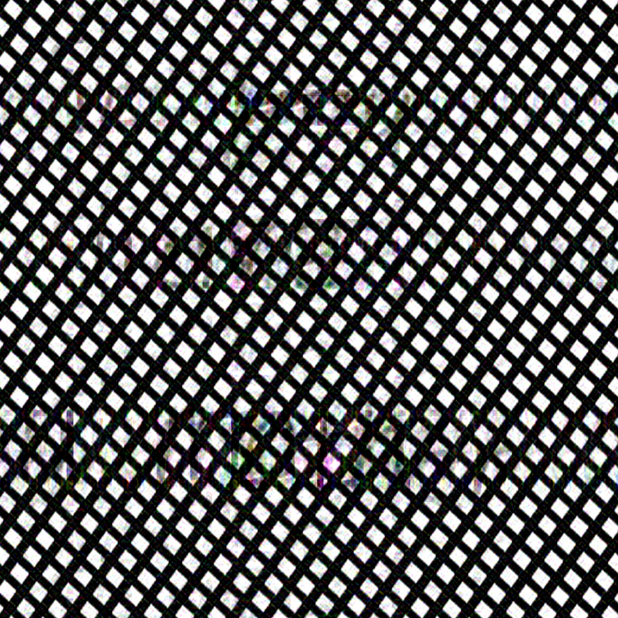

# Task-3: Сингулярное разложение и сжатие изображений

## Структура сжатого файла

| Name   | Offset | Type   | Description   |
| ------ | ------ | ------ | ------------- |
| header | 0x0    | header | File metadata |
| body   | 0x10   | body   | File payload  |

### Header
First 16 bytes of the file are allocated for the header.

| Name | Offset | Type    | Description                       |
| ---- | ------ | ------- | --------------------------------- |
| n    | 0x0    | uint32  | Horizontal size of original image |
| m    | 0x4    | uint32  | Vertical size of original image   |
| k    | 0x8    | uint32  | One of sizes of stored matrices   |
| mode | 0xC    | char[4] | Order of saved channels           |

### Body
After file header comes main body, consisting of several consecutive channels (in accordance with channels in the original image).

| Name     | Type   | Description                           |
| -------- | ------ | ------------------------------------- |
| channels | chan[] | Compressed channels of original image |

#### Channel
Each channel is described by `n*k+k+k*m` 32 bit floating point numbers:
- first `n*k` floats define the matrix U
- next `k` define the diagonal of matrix S
- next `k*m` define the matrix Vh
Where matrices U, S and Vh correspond to matrices $`U`$, $`S`$, and $`V^*`$, from [here](https://en.wikipedia.org/wiki/Singular_value_decomposition#Compact_SVD)

| Name | Type         | Description              |
| ---- | ------------ | ------------------------ |
| U    | float32[n*k] | First matrix             |
| S    | float32[k]   | Second matrix (diagonal) |
| Vh   | float32[k*m] | Third matrix             |

## Реализованные методы
- **numpy** - svd предоставленное библиотекой numpy, реализация lapack svd
- **simple** - svd с использованием [степенного метода](http://www.cs.yale.edu/homes/el327/datamining2013aFiles/07_singular_value_decomposition.pdf)
- **advanced** - svd с использованием блочного степенного метода представленного в [статье](https://www.degruyter.com/document/doi/10.1515/jisys-2018-0034/html)
## Пример результата
```
method: numpy
img: ../imgs/luntik3.bmp
time: 10
compression: 5
```
<div style="display: flex; justify-content: center;">
    
    
</div>

---

```
img: ../imgs/luntik3.bmp
time: 0.4
compression: 5
```
<div style="display: flex; justify-content: center;">
    
    
</div>

---

```
method: simple
img: ../imgs/luntik3.bmp
time: 0.4
compression: 5
```
<div style="display: flex; justify-content: center;">
    
    
</div>

## Изучение результатов

#### Подготовка

Запуск проводился на машине с ОС `Ubuntu 20.04.5 LTS x86_64`, версией python `3.12.1`, версией библиотеки numpy `1.26.4`, на процессоре `AMD Ryzen 7 4700U`.

Ход проведения:
- запускаем программу с параметром сжатия `n` и методом сжатия `numpy`
- берём за `t` среднее время сингулярного разложения матрицы при прошлом запуске
- запускаем программу с параметром сжатия `n`, методом сжатия `advanced` и ограничением по времени временем `t`
- запускаем программу с параметром сжатия `n`, методом сжатия `simple` и ограничением по времени временем 0.01 (для `simple` метода выбираем именно такое ограничение по времени, так как даже при таком ограничении, время затраченное на разложение матриц гораздо больше из-за его специфики)

В качестве картинки для изучения была выбрана [следующая](./imgs/mother.bmp).



#### Результаты

##### Compression = 2

| [numpy](./imgs/mother_2.numpy.bmp) | [advanced](./imgs/mother_2.advanced.bmp) | [simple](./imgs/mother_2.simple.bmp) |
|-|-|-|
|  |  |  |


simple:


numpy: (у advanced похожий результат)


Видно, что simple выдаёт менее качественный результат, вместо чисто чёрного цвета было получено разнообразие размытых цветов.

##### Compression = 4

| [numpy](./imgs/mother_4.numpy.bmp) | [advanced](./imgs/mother_4.advanced.bmp) | [simple](./imgs/mother_4.simple.bmp) |
|-|-|-|
|  |  |  |

numpy:


advanced:


simple:


Simple опять выдал разноцветные пятна, но по сравнению с прошлым результатом advanced тоже изменил цвет букв (сделал "So" (слева) красненьким), в отличие от numpy, который сохранил первоначальный чёрный цвет. Но по субъективному мнению, картинка advanced местами имеет чуть более чёткое изображение по сравнению с numpy.


#### Оценка результатов
Метод  `simple` показал себя хуже других методов как по времени, так и по качеству тестовой картинки. Время его выполнение могло быть ещё дольше, если включить в программе мультистарт, однако по этой же причине он был отключен. 
Методы `advanced` и `numpy` показали совпадающие результаты при примерно равном времени, однако при ближайшем рассмотрении `numpy` оказался чуть лучше. 

Также на некоторых входных данных (к примеру полностью белом изображение на 1920x1080) `simple` несколько раз падал из-за переполнения float и установки его значения в `+inf`, что стоит отнести к минусу конкретной реализации, но лёгкого способа устранения этой проблемы найдено не было.